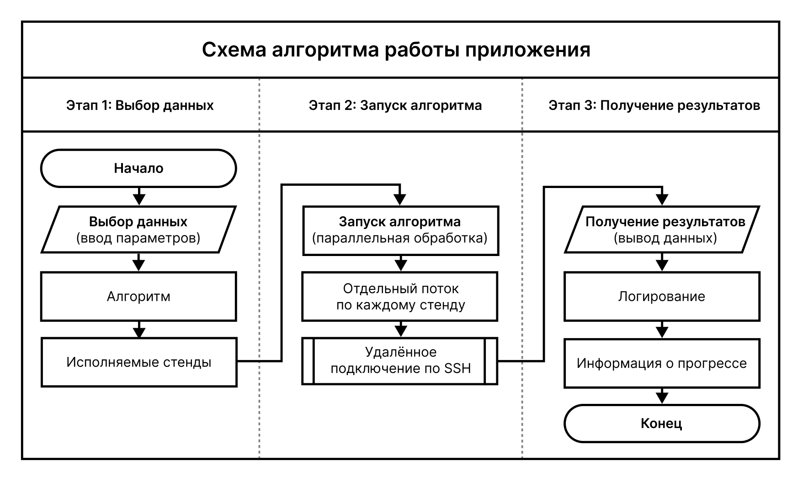
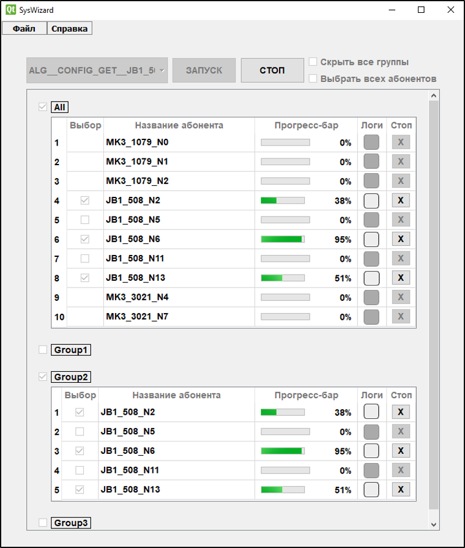
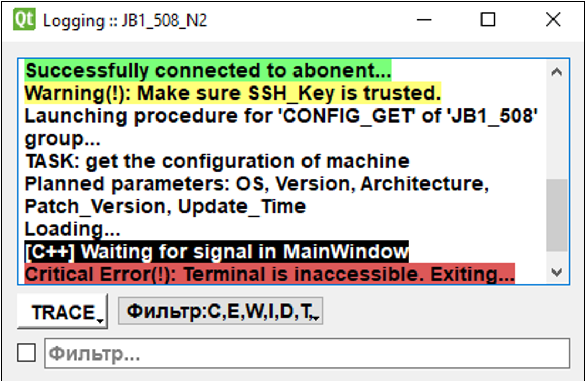
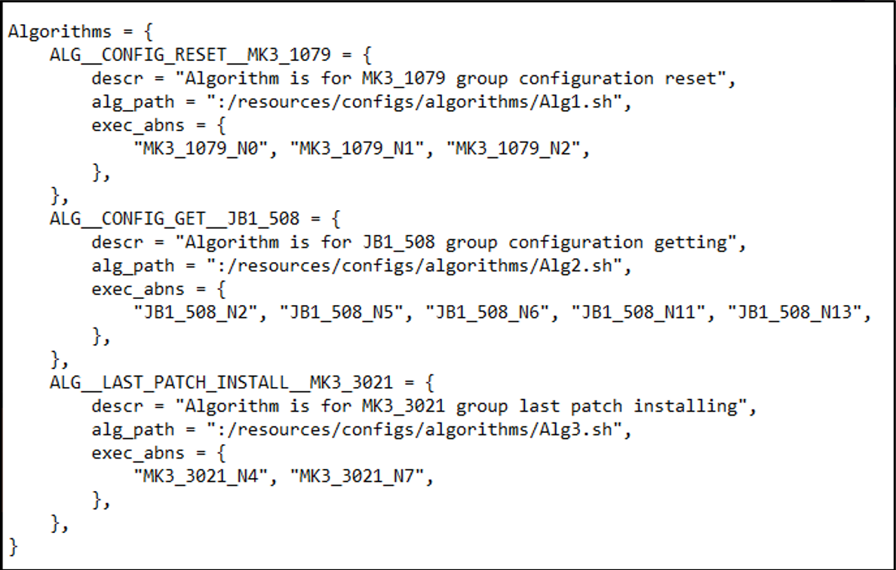

# Application-for-automating-software-updates-on-virtual-test-benches

### Приложение для автоматизации обновления программного обеспечения на виртуальных испытательных стендах

Приложение осуществляет:
1. Возможность выбора и конфигурирования стендов, их групп, а также выполняемых на них алгоритмов обслуживания, таких как установка ПО, его обновление, изменение системных параметров, перенастройка окружение и другое.
2. Удалённое подключение к стендам с многопоточным выполнением на них алгоритмов обслуживания и одновременным получением результатов.
3. Считывание и отображение логирования на разных, изменяемых уровнях и получение информирования о прогрессе выполнения алгоритмов.

### Цикл работы приложения

### Главное окно приложения во время удалённого выполнения алгоритма на стендах

### Окно логирования

### Файл конфигурационных данных (на примере раздела информации об алгоритмах)

